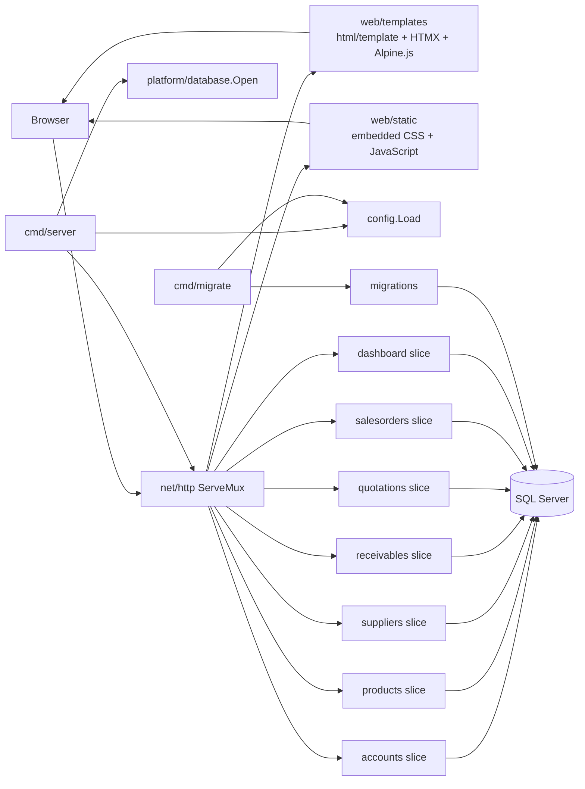
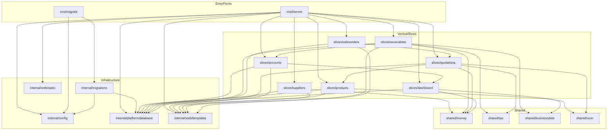

# Architecture Graph

This graph reflects the current implementation. The server is composed from vertical slices; each slice owns its handlers, domain logic, and repository boundary. The migration executable shares configuration and database infrastructure with the server.

## Runtime Flow

## Package Dependencies

## Conventions

- HTTP handlers register routes with the shared `http.ServeMux`.
- Repositories hide GORM and SQL Server details from slice services and handlers.
- Templates and static assets are embedded into the binary.
- `analysis/000-implementation-ladder.md` remains the source of truth for implementation status.
